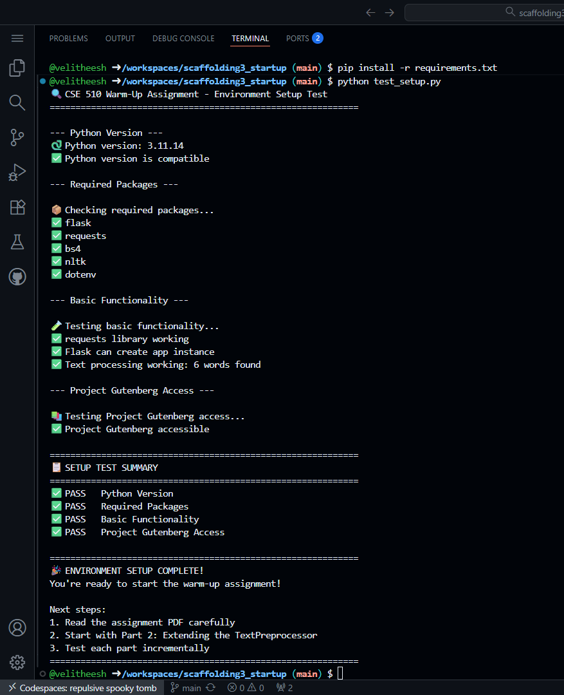
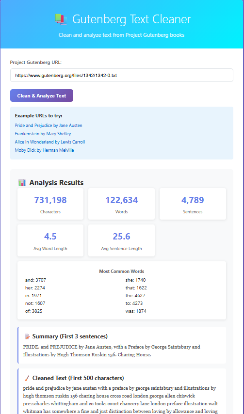
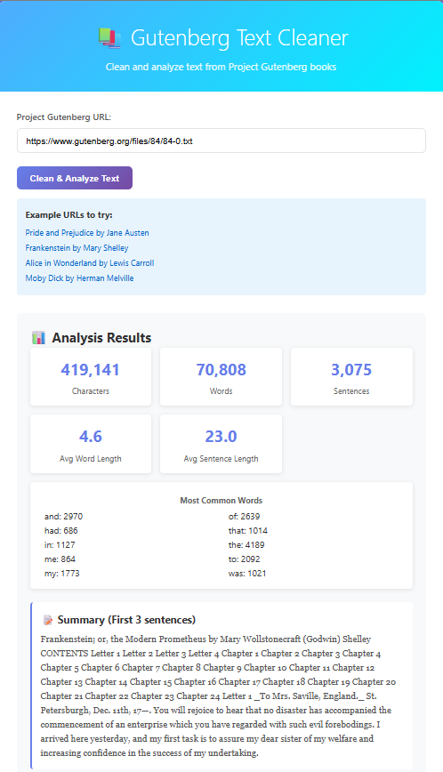
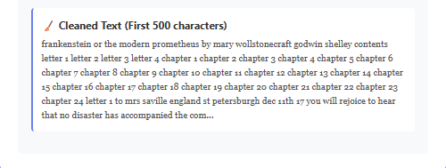
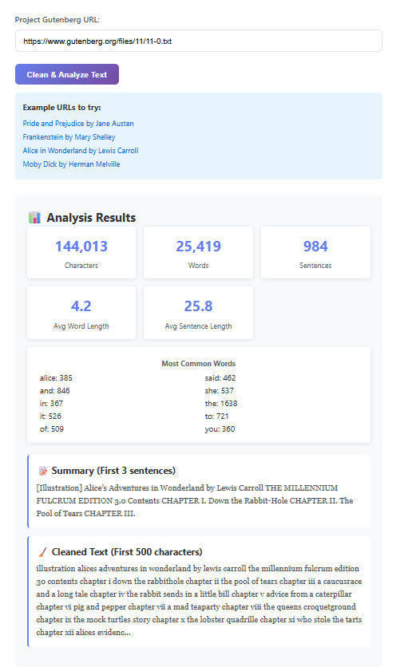
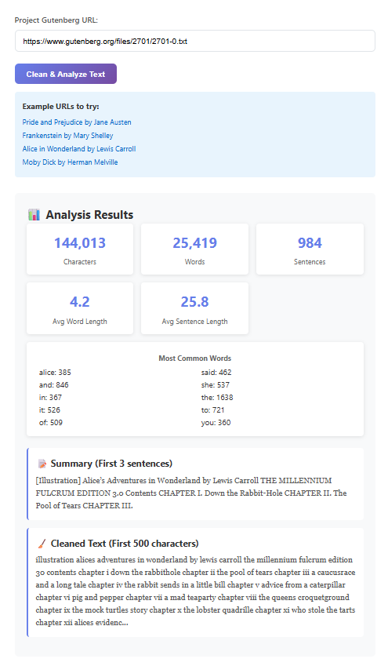

# CSE 510 Warm-Up Assignment: Text Preprocessing Web Service


# Screenshots of the outputs

## Test Setup Success

## Screenshot 1

## Screenshot 2


## Screenshot 3

## Screenshot 4



#
Welcome to the warm-up assignment for CSE 510! This assignment will help you get familiar with text preprocessing, web development with Flask, and working with Project Gutenberg texts before diving into the main Shannon Information Theory assignment.

## 🎯 Assignment Overview

You'll build a web service that:
- Fetches text from Project Gutenberg URLs
- Cleans and preprocesses the text
- Provides statistical analysis
- Returns results via a clean web interface

## 🚀 Quick Start

### 1. Environment Setup

First, test your environment:
```bash
python test_setup.py
```

If all tests pass, you're ready to go! If not, install missing packages:
```bash
pip install -r requirements.txt
```

### 2. Run the Application

Start the Flask development server:
```bash
python app.py
```

Open your browser to: http://localhost:5000

### 3. Test the Interface

The web interface includes example URLs you can click to test:
- Pride and Prejudice by Jane Austen
- Frankenstein by Mary Shelley  
- Alice in Wonderland by Lewis Carroll
- Moby Dick by Herman Melville

## 📝 What You Need to Implement

### Part 1: Environment Setup (10 points)
- Run `test_setup.py` and ensure all tests pass
- Verify you can access Project Gutenberg URLs

### Part 2: TextPreprocessor Methods (25 points)

Complete these methods in `starter_preprocess.py`:

#### `fetch_from_url(url: str) -> str`
- Download text content from a Project Gutenberg URL
- Validate that the URL ends with `.txt`
- Handle network errors appropriately
- Return the raw text content

#### `get_text_statistics(text: str) -> Dict`
- Return a dictionary with:
  - `total_characters`: Total character count
  - `total_words`: Total word count  
  - `total_sentences`: Total sentence count
  - `avg_word_length`: Average word length
  - `avg_sentence_length`: Average sentence length (words per sentence)
  - `most_common_words`: List of top 10 most common words

#### `create_summary(text: str, num_sentences: int = 3) -> str`
- Extract the first N sentences from the cleaned text
- Return as a single string

### Part 3: Flask API Endpoints (10 points)

Complete these endpoints in `app.py`:

#### `POST /api/clean`
Expected input:
```json
{"url": "https://www.gutenberg.org/files/1342/1342-0.txt"}
```

Expected output:
```json
{
    "success": true,
    "cleaned_text": "It is a truth universally acknowledged...",
    "statistics": {
        "total_characters": 717571,
        "total_words": 124588,
        "total_sentences": 6403,
        "avg_word_length": 4.3,
        "avg_sentence_length": 19.5,
        "most_common_words": ["the", "to", "of", "and", "a", ...]
    },
    "summary": "It is a truth universally acknowledged..."
}
```

#### `POST /api/analyze`
Expected input:
```json
{"text": "Your raw text here..."}
```

Expected output:
```json
{
    "success": true,
    "statistics": {...}
}
```

### Part 4: Frontend Integration (5 points)

Complete the JavaScript in `templates/index.html`:
- Implement the form submission handler
- Make proper API calls to `/api/clean`
- Handle responses and errors
- Display results using the provided `displayResults()` function

## 🧪 Testing Your Implementation

### Manual Testing
1. Start the server: `python app.py`
2. Open http://localhost:5000
3. Try the example URLs
4. Verify statistics make sense

### Code Testing
```bash
# Test individual components
python starter_preprocess.py

# Test specific methods
python -c "
from starter_preprocess import TextPreprocessor
tp = TextPreprocessor()
# Test your implementations here
"
```

## 📁 Project Structure

```
warmup-starter-repo/
├── README.md                    # This file
├── requirements.txt             # Python dependencies
├── test_setup.py               # Environment validation
├── app.py                      # Flask application (TODO: implement endpoints)
├── starter_preprocess.py       # Text processing (TODO: implement methods)
└── templates/
    └── index.html              # Web interface (TODO: implement API calls)
```

## 🎓 Learning Objectives

By completing this assignment, you will:
- Understand text preprocessing fundamentals
- Learn basic web API development with Flask
- Practice working with external data sources
- Gain experience with JSON APIs and frontend integration
- Build confidence for the main Shannon assignment

## 💡 Tips for Success

1. **Start with Part 2**: Implement the TextPreprocessor methods first
2. **Test incrementally**: Test each method as you implement it
3. **Use the existing methods**: The starter code provides helper methods for tokenization
4. **Handle errors gracefully**: Project Gutenberg URLs can sometimes be slow
5. **Read the comments**: The TODO comments provide helpful hints

## 🆘 Common Issues

**"Module not found" errors**: Run `pip install -r requirements.txt`

**Network timeouts**: Project Gutenberg can be slow; add reasonable timeouts to your requests

**Text encoding issues**: Project Gutenberg uses UTF-8; specify encoding when needed

**Port already in use**: Kill existing Flask processes or use a different port

## 📚 Resources

- [Flask Documentation](https://flask.palletsprojects.com/)
- [Requests Library](https://requests.readthedocs.io/)
- [Project Gutenberg](https://www.gutenberg.org/)
- [Regular Expressions in Python](https://docs.python.org/3/library/re.html)

## 🎯 Grading Rubric

- **Environment Setup (10 points)**: `test_setup.py` passes all tests
- **TextPreprocessor Implementation (25 points)**: All three methods work correctly
- **Flask API Endpoints (10 points)**: Both endpoints return proper JSON responses  
- **Frontend Integration (5 points)**: Web interface successfully calls APIs and displays results

**Total: 50 points**

Good luck! This assignment prepares you for the main Shannon Information Theory assignment where you'll implement n-gram models and text generation using similar preprocessing techniques.
